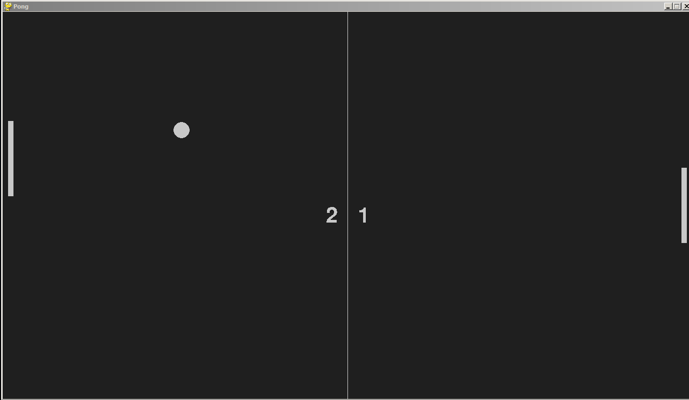

# Pong Game
> This is a pong game which is a clone of the original pong game which was played on the TRS-80

## Table of contents
* [General info](#general-info)
* [Screenshots](#screenshots)
* [Modules Used](#modules)
* [Features](#features)
* [Setup](#setup)
* [Status](#status)
* [Inspiration](#inspiration)

## General info
In this project, I have used the PyGame library for the major part and the sys and random module.

## Screenshots


## Modules
* Pygame
* sys
* random

## Features
* Countdown timer before starting to get ready
* You can play with the computer as your opponent
* Score board to keep track of the score (also to know how bad you are against the computer)

## Setup
* Clone the repository with 
```
git clone <enter this page url>
```
* Write this in yout terminal
```
pip install -r requirements.txt
OR
pip install pygame
```

## Status
Project is:_finished_

## Inspiration
Inspired by the original pong game on the TRS-80
